# Quantile Forecasts Using Neural Networks for Retail Inventory Management with Fixed-Time Replenishment Intervals

**Willians Cassiano de Freitas Abreu**

Master's thesis in Informatics, preliminary defense (qualifying exam), Graduate Program in Informatics, Federal University of Amazonas (UFAM), Manaus, August 2019.
Advisor: Prof. Marco Antônio Pinheiro de Cristo. Co-advisor: Prof. Juan Gabriel Colonna.

> This is a Markdown version of the thesis text, for reading on GitHub. For the typeset version, see the [PDF](Master's%20Thesis%20Text%20Preliminary%20Defense.pdf).

## Abstract

A retail business must keep the customer demand satisfied in order to have some customer captivity. Assuming suppliers have a delivery time (lead time), some level of inventory is needed to meet the customer demand. However, it is expected that due to uncertainty in expected sales, the retailers will have to keep a safe level of stock to avoid unmet demand with, consequently, some overstocking cost. In practice, in Brazil, a noteworthy part of the internal operation costs comes from these overstocking costs which include holding costs, opportunity costs, and losses associated with damaged, expired and stolen items. On the other hand, an unmet demand leads to stock-out events which can be more burdensome to the retailer's operation than the overstocking depending on the affected product segment. These two problems – stock-outs and overstocking – are the main concern of our work. To tackle them, we developed a mathematical model that minimizes the financial losses due to stock-outs and overstocking in a scenario where demand and lead times are stochastic and the replenishment intervals are fixed. We empirically show the performance of different models under several constraint configurations, and propose the use of an objective function for a gradient descent optimization method.

**Keywords:** Inventory Management, Deep Learning, Quantile Forecast.

## Contents

- [1 Introduction](#1-introduction)
  - [1.1 Problem definition](#11-problem-definition)
  - [1.2 Research Hypothesys](#12-research-hypothesys)
  - [1.3 Main objective](#13-main-objective)
  - [1.4 Thesis structure](#14-thesis-structure)
- [2 Theoretical Foundations](#2-theoretical-foundations)
  - [2.1 Inventory Management Policies](#21-inventory-management-policies)
  - [2.2 Uncertainties in demand and lead times](#22-uncertainties-in-demand-and-lead-times)
  - [2.3 Service Levels and Quantile Forecasts](#23-service-levels-and-quantile-forecasts)
  - [2.4 Pinball Loss](#24-pinball-loss)
  - [2.5 Directly optimizing $`C`$ using Neural networks](#25-directly-optimizing-c-using-neural-networks)
  - [2.6 Method Proposal](#26-method-proposal)
  - [2.7 Related work](#27-related-work)
  - [2.8 Closing Remarks](#28-closing-remarks)
- [3 Neural Networks for quantile forecasts](#3-neural-networks-for-quantile-forecasts)
  - [3.1 Case study](#31-case-study)
  - [3.2 Preprocessing](#32-preprocessing)
  - [3.3 Neural Network Architecture and Training](#33-neural-network-architecture-and-training)
- [4 Simulator, Model evaluation and Preliminary Results](#4-simulator-model-evaluation-and-preliminary-results)
  - [4.1 Simulating retailer mechanics](#41-simulating-retailer-mechanics)
  - [4.2 Model evaluation and Preliminary Results](#42-model-evaluation-and-preliminary-results)
- [5 Open Problems and Next Steps](#5-open-problems-and-next-steps)
  - [5.1 Aggregated Pinball Loss](#51-aggregated-pinball-loss)
  - [5.2 Temporal Connectionist Methods](#52-temporal-connectionist-methods)
  - [5.3 B and C segments](#53-b-and-c-segments)
  - [5.4 Schedule](#54-schedule)
- [References](#references)

## 1 Introduction

Under the discipline of competitive strategy, there is an emphasis on operational efficiency as a major contributor to the success or failure of any business (Greenwald and Kahn 2005). That is – all else being equal, the market player with highest operational efficiency has a significant competitive advantage.

On retail businesses, a noteworthy part of the internal operation costs comes from inventory costs. In the medium-sized brazilian supermarket network subject to this study, we found that inventory net holding costs alone spans from 3 to 6 % of annual revenue, as per Section 3.1. With the operating margins of these same businesses typically around 4 - 8%, we can see that any improvement in operational costs yields a remarkable profit increase.

That said, a retail business, especially brick and mortar ones, must keep the customer demand satisfied in order to have some customer captivity. Assuming suppliers have a delivery time – henceforth called *lead time* – greater than the time it takes to fulfill an order, some level of inventory is needed to meet, at least partially, the customer demand. However, it is expected that due to uncertainty in expected sales, a retailer will have to keep some safe level of stock to avoid unmet demand.

Moreover, the added unreliability of lead times from suppliers will contribute to *overstocking*, increasing the *holding cost*. It is expected that overstocking also contributes to jointly increase working capital requirements and opportunity costs for a retailer, consequently lowering its margins. Besides that, having stock excess will increase the retailer losses with respect to damaged, expired and stolen items.

In the opposite case, when there is unmet demand for an item in a store, a *stock-out* event happens. Almost fifty years of studies have been made in order to quantify the costs, causes, and reactions to *out-of-stock* (OOS) events. Jesper Aastrup and Herbert Kotzab (Aastrup and Kotzab 2010) have made an extensive review on the subject. In most of these reviewed studies, a level of out of stock of 7-8% has been observed. Walter and Grabner (Walter and Grabner 1975) conclude that, despite having substitute products in stock, revenue was lost in more than 38% of cases. In 14% of cases, the sale was entirely lost.

According to Hugos (Hugos 2018), the top 5% best selling items are responsible for roughly half of the company results, and makes up the first segment (A1) under ABC analysis[^1]. The author also estimated that the stock-out cost is ten to twenty times more burdensome to the retailer’s operation than the overstocking cost in this segment. This asymmetrical cost arises from the fact that these retailers operate under a very strict profit margin for the best selling products, and expect to capitalize on costumers that go to the store for one of these items and end up buying other products (Aastrup and Kotzab 2010), that have a slightly higher margin.

The two problems mentioned above – stock-outs and overstocking – are the main concern of our work. To tackle them, we developed a mathematical model that minimizes the financial losses due to stock-outs and overstocking in a scenario where demand and lead times are stochastic. We empirically show the performance of different models under several constraints configurations, and propose the use of an objective function for a gradient descent optimization method.

### 1.1 Problem definition

Models adopted to optimize financial costs associated with stock-out and overstocking, in scenarios with stochastic demand and lead times, usually assume that the problem’s underlying probability distributions are known. Our main goal in this work is to test if inventory control policies that directly optimize such financial costs, without making explicit assumptions about the probability distribution for relevant events, achieve better performance than traditional approaches.

To this end, we first define the cost $`C`$ we intend to minimize. This cost is associated with each purchase decision on a retailer operation and represents the weighted financial overstocking or stock-out penalties resulting from that purchase. In the following paragraphs, we provide a formal definition for $`C`$.

We denote the demand for a given item as $`\boldsymbol{d}`$, a vector $`[d_1, d_2, d_3, ..., d_t, ..., d_{n-1}, d_n]`$ for $`t, n \in \mathbb{Z}^+`$ and $`d_t \in \mathbb{R}^+`$, representing a discrete time series. In our work, $`d_t`$ will usually refer to the sales observed at day $`t`$ – the terms demand and sales will be used interchangeably, given our focus on retail operations. Let

``` math
\boldsymbol{d}[i:j] = \sum_{t=i}^{j} d_t, \tag{1.1}
```

``` math
Y = \sum_{t + \ell_t}^{t + r + \ell_{t + r}} d_i, \tag{1.2}
```

``` math
Y = \sum_{i=0}^{\ell} X_i, \tag{1.3}
```

be the cumulative demand over the interval $`[i, j]`$. The demand points $`d_t`$ and, consequently $`\boldsymbol{d}`$, are random variables with a probability density function (PDF) that we refer to as $`D`$.

In retail operations, for the A segment items, fixed-time replenishment is usually adopted (Hugos 2018). Fixed-time replenishment is an inventory management policy that evaluates the available stock in a given point in time, and places orders periodically according to logistic restraints.

Let $`r \in \mathbb{Z}^+`$ be the replenishment period of the analyzed item, and $`\ell_t`$ the time interval between the placement of an order at time $`t`$, and its fulfillment (lead time). We assume the lead times to follow a PDF, referred to as $`L`$.

We denote
``` math
y_t = \boldsymbol{d}[t + \ell_t : t + r + \ell_{t + r}], \tag{1.4}
```
the cumulative demand from the arrival of the order placed at time $`t`$, $`t + \ell_t`$, to the arrival of the next order at $`t + r + \ell_{t + r}`$. Then, the optimal order quantity at $`t`$ will be:

``` math
p^\ast_t = \max(y_t - i_t, 0), \tag{1.5}
```

which represents the current inventory level $`i_t`$ subtracted from the cumulative expected demand that needs to be met. This inventory control policy is called *order up-to policy* (Hugos 2018; Chen et al. 2000). Therefore, the optimal inventory level at time $`t`$ should be

``` math
i^\ast_t =  \boldsymbol{d}[t: t + \ell_t], \tag{1.6}
```

the stock needed to meet the demand until the arrival of the order placed at $`t`$.

It is worth noting that the optimal inventory level at the next decision time point $`i^\ast_{t + r}`$, is contained in $`p^\ast_t`$. That means that a fixed-time replenishment policy needs to take into account the lead time of the next order to make the best possible purchase decision at time $`t`$.

Figure 1.1 depicts an optimal inventory series with two consecutive decision points. It represents the decisions points $`t`$ and $`t + r`$, the lead times $`\ell_t`$ and $`\ell_{t + r}`$, while also showing the evolution of $`i^\ast_t`$ over time.

<p align="center">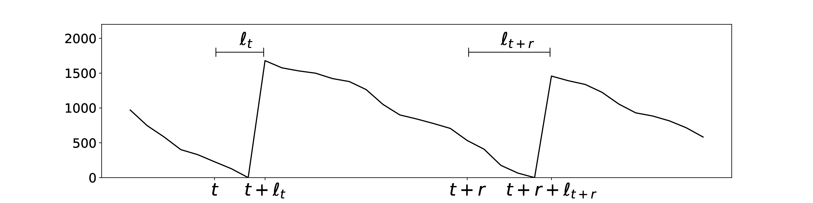</p>

**Figure 1.1:** Sample of optimal inventory series points, $`i^\ast_t`$.

Since $`\ell_t`$ and $`d_t`$ are stochastic variables, we resort to estimates of $`y_t`$, denoted by $`\hat{y_t}`$. Our goal is to produce a model that estimate $`y_t`$ taking into account the uncertainty in the above quantities. We introduce the concept of *service level* to deal with uncertainty (Hugos 2018). It is defined as the percentile $`\tau`$ representing the probability of $`\text{P}(i_t > d_t)`$.

The service level indicates the chance that all customers will have their demand met on a randomly chosen $`t`$. It is usually a performance measurement of inventory control models. Finally, a general model to estimate $`y_t`$ from the demand distribution, lead times distribution and replenishment interval can be denoted as
``` math
\hat{y_t} = m(D, L, r, \tau; \theta), \tag{1.7}
```

where $`\theta`$ is the set of free parameters of $`m`$.

As we seek to reduce financial costs associated with stock-outs and overstocking due to purchase orders derived from $`\hat{y_t}`$, we should then try to minimize the distance between $`y_t`$ and $`\hat{y_t}`$. As we mentioned earlier, the holding costs *versus* the stock-out costs are usually asymmetrical, and proportional to $`\tau`$. Therefore, a usefull model for inventory management with periodic revision in retail operations should be evaluated using the objective function

``` math
C(y_t, \hat{y_t}) = 
    \begin{cases}
        (y_t - \hat{y_t})\tau & \text{if } y_t\geq \hat{y_t}\\
        (\hat{y_t} - y_t)(1 - \tau) & \text{otherwise}.
    \end{cases} \tag{1.8}
```

Cost function $`C(y_t, \hat{y_t})`$ is colloquially called Pinball Loss Function (Koenker and Bassett Jr 1978; Biau and Patra 2011) and it is a particular discrete case of the more general Continuous Ranked Probability Score (Gneiting and Raftery 2007).

The first term of Equation 1.8 refers to the case in which the forecast fell short of the realized demand, caused a out-of-stock event, and should only happen with probability $`(1 - \tau)`$. Its second term treats the case in which the forecasts overshoots and is expected to happen with probability $`\tau`$.

Then, we consider
``` math
\operatorname*{arg\,min}_{\theta} C(y_t, m(D, L, r, \tau; \theta)), \tag{1.9}
```

the particular configuration of $`\theta`$ that minimizes the financial costs associated with our estimates of optimal purchase decisions.

There exists various models that optimize $`C`$, either by directly solving for $`\theta`$ under these constraints, or by making assumptions about the underlying PDFs $`D`$ and $`L`$. In this work, we propose and compare several models that optimize $`C`$ – either directly or indirectly – and assess their performance under real world demand and lead time data.

### 1.2 Research Hypothesys

In this work, we suppose that models that directly optimize the cost function $`C`$ reduce the financial costs associated with both overstocking and out-of-stock events under real world data simulations.

### 1.3 Main objective

The main objective of this work is to propose and validate an effective forecast model and inventory management policy able to adhere to service level constraints when applied to a scenario where demand and lead times are stochastic.

#### 1.3.1 Specific objectives

To attain our main objective, the following specific objectives ought be achieved:

1.  Implement a simulator, able to reproduce the relevant retailer mechanics observed from real data.

2.  Develop a baseline model that indirectly optimizes for $`C`$, based on the relevant literature.

3.  Develop models that directly optimize for $`C`$, using Artificial Intelligence techniques, that perform better than the baseline models, evaluated on the relevant metrics.

### 1.4 Thesis structure

In this chapter we developed the context and motivation for our work. We briefly described our problem space and our objectives. In the following chapters, we review the related works in the adequate literature, detail this work methodoly and its theoretical foundation and explain our proposed model. At the end, after presenting our results, we discuss their implication and propose future works.

## 2 Theoretical Foundations

In this chapter, we further develop our understanding of inventory management policies, its context, related metrics and relevant probabilistic interpretations. We also lay the groundwork for our forecasting method, explaining the applied model and optimization techniques.

### 2.1 Inventory Management Policies

On a typical brick and mortar retailer, the staff maintains a certain level of stock on hand to meet customer demand, since most buyers will not order their goods ahead of time. This stock quantity to support sales over a period of time is called the *cycle inventory* (Hugos 2018).

In most cases, retailers will benefit from ordering large quantities of items, to lower its cost per unit and achieve economies of scale. However, the economies scale eventually cancel out with the holding cost over long periods of time, as shown in the next paragraphs.

The holding cost, also called *carrying cost* is the total cost of holding inventory. This includes warehousing costs such as rent, utilities and salaries, financial costs such as opportunity cost, and inventory costs related to perishability, shrinkage (leakage) and insurance (Russell and Taylor 2005).

The equilibrium between ordering and holding costs is well studied in the operations research literature, and its solution – under specific restraints – is called the Economic Order Quantity (EOQ) model (Hax and Candea 1984). Solving the EOQ equation

``` math
p^\ast = \sqrt{\frac{2DK}{h}}, \tag{2.1}
```

yields the optimal order quantity to balance ordering costs and holding costs. In Equation 2.1, $`D`$ is the expected demand over the time interval under analysis, $`K`$ is the cost per order and $`h`$ is the holding cost per unit.

With the optimal order quantity, one can compute the number of orders to be placed in the time period under analysis. Based on the number of orders, it is possible to derive $`r`$, the optimal replenishment interval to optimize the supply chain for minimal holding and ordering costs.

One caveat is that the EOQ model assumes constant demand $`D`$ over the inspected interval. Also, it expects orders to be fulfilled in constant time – ignoring the irregularities in lead times. As shown in the next sections, these are not realistic assumptions. To circunvent these uncertainties, retailers keep surplus stock with the purpose of supporting – reasonable – variability in these two quantities.

This extra inventory quantity is called *safety inventory* or *safety stock* (Hugos 2018).

To simplify our models, we will ignore the upper echelons (Graves 1996) and assume that a item is only available to be acquired from a single supplier and will go directly to the shelves, meaning that no distribution takes place inside the retailer’s network or the supplier’s network. We also suppose that there is no order crossing, i.e. $`\ell_t < r`$, $`\forall t`$ where $`\ell_t`$ is the lead time for an order placed at time $`t`$ and $`r`$ is the replenishment period.

### 2.2 Uncertainties in demand and lead times

Under the EOQ assumptions, the lead times and customer demand are constant over time. To simplify our equations for the time being, let $`\ell_t = 0`$ be the time it takes to fulfill an order. The retailer manager will place an order of optimal quantity ($`p^\ast`$) at time $`t`$, wait for $`r`$ days and repeat the process, since the cumulative demand over the interval is equal to the optimal order quantity ($`\boldsymbol{d}[t:t+r] = p^\ast`$), the retailer have zero inventory at the decision point ($`i_t = 0`$), and orders are fulfilled instantly. With these restraints, the inventory series over time produces the well known sawtooth pattern seen in Figure 2.1.

<p align="center">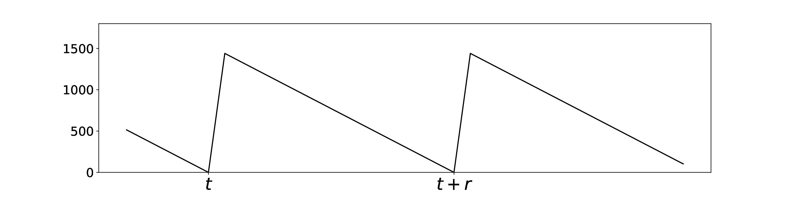</p>

**Figure 2.1:** Sample of optimal inventory series, $`i^\ast_t`$, assuming constant demand over time, and $`\ell_t = 0`$

However, in reality, the demand on retailers is stochastic with an unknown probability distribution. As the sales are the result of a unknown number of variables exogenous to our model, in practice we can only observe their end effect. The demand is frequently assumed in the literature to be a Binomial (Agrawal and Smith 1996; Smith and Agrawal 2000), Poisson (Bradford and Sugrue 1990; Nahmias 1994), Gamma (Burgin 1975) or Normal (Agrawal and Smith 2013; Fisher et al. 2001) random variable. For a review on the subject, refer to the paper by Ramaekers et al. (Ramaekers et al. 2008) and the paper by Bartezzaghi et al. (Bartezzaghi et al. 1999).

The Binomial distribution is useful to represent sales in retail, because it describes the probability of given number of successes in $`n`$ Bernoulli trials. Bernoulli trials are i.i.d binary events with probability of success $`P(X\!=\!1) : p`$, and probability of failure $`P(X\!=\!0) : (1 - p)`$.

Now, assuming that the event of a given customer buying one unit of a specific item is a Bernoulli trial and there are infinitely many customers ($`n \to \infty`$), one can expect the probability of the demand on a given day to be accurately described by a Poisson distribution. Conversely,

``` math
P(d_t) = e^{-\lambda}\frac{\lambda^{d_t}}{d_t!}, \tag{2.2}
```

where $`d_t`$ represents one particular value of daily demand, and $`\lambda`$ represents the expected value (or mean) of daily sales. On a Poisson distribution, $`\lambda = \mu = \sigma^2`$ (Kelly 1994).

Recall that the quantity that we are interested in is $`\boldsymbol{d}[t:t+r]`$, the cumulative demand over the next replenishment interval – assuming $`\ell_{t+r} = 0`$. Then, if we take $`D`$ to be a Poisson distribution with mean $`\mu_D = \lambda`$ and variance $`\sigma_D^2 = \lambda`$, $`\boldsymbol{d}[t:t+r]`$ is a Discrete Compound Poisson distribution, with $`\mu = r\lambda`$ and $`\sigma^2 = r(\lambda^2 + \lambda)`$ (Kelly 1994).

In our case, as in the literature (Peterson and Silver 1979; Ramaekers et al. 2008; Agrawal and Smith 1996; Tyworth and O’Neill 1997), it is useful to assume $`D`$ to be normally distributed for large enough values of $`\lambda`$. As stated in our Problem Definition Section 1.1, we are interested in the A1 items in the ABC curve, where demand is large enough for this assumption to be made with confidence. The normality assumption for sales allow us to consider $`D`$ to be $`\mathcal{N}(\mu_D,\sigma^2_D)`$, effectively decoupling the mean and variance of the distribution.

Another approach is to consider $`D`$ to be a Gamma distribution (Burgin 1975). Although the Gamma distribution has properties that are significant for slower moving items, such as non-negativity and assimetricity, it is not so relevant in this work, given that the Gaussian is more tractable most of the time in our context. For Gaussian distribution, parameter estimation and composition with other distributions is relatively straightforward (Ramaekers et al. 2008; Agrawal and Smith 1996). The compound probability distribution $`\boldsymbol{d}[t:t+r]`$, considering $`d_t`$ to follow a Gaussian distribution, is described by $`\mathcal{N}(r\mu_D, r\sigma_D^2)`$ (Kelly 1994). On discrete cases, compound distributions are also called convolutions.

Now let us consider the lead times distribution $`L`$ and its impact on our inventory control model. As explained in our Problem Definition 1.1, orders are not fulfilled in constant time on real world retail shops. Lead times are stochastic and, as with demand, its causes are non-observable variables. The lead times will vary depending on factors such as logistic constraints, production constraints, unforeseable events – natural disasters, systemic failures, supply chain disruptions, supply chain attacks – among others (Hugos 2018).

In order to properly control inventory levels, one needs to take into account the irregularities of lead times, specially when computing *safety stocks*. In the works by Tyworth and O’neill (Tyworth and O’Neill 1997) and by Bagchi, Hayya and Chu (Bagchi et al. 1986), the authors explore the implications of choices for lead times distributions ($`L`$) and its impact on inventory control models. The aforementioned authors, among others (Eppen and Martin 1988; Keaton 1995; Song et al. 2000) take the normality assumption for lead times to be a justifyable one when there are reasonable large sample sizes.

When analyzing the A1 items on the ABC curve, short replenishment intervals ($`r`$) are practiced to lower the holding costs and business working capital requirements. For instance, in our case study (cf. Section 3.1), the retailer adopts values for $`r \leq 15`$ for these items. This choice of $`r`$ yields large samples of lead times.

Recal that the quantity $`y = \boldsymbol{d}[t:t+r + \ell_{t+r}]`$ is the cumulative demand until the next order arrival. Assuming $`\ell_t \sim \mathcal{N}(\mu_L, \sigma_L^2)`$, the resulting probability distribution of $`y`$,

``` math
Y \sim \mathcal{N}((r + \mu_L)\mu_D, (r + \mu_L)\sigma_D^2 + \mu_D^2\sigma_L^2), \tag{2.3}
```

describes the expected demand over that interval (Bagchi et al. 1986).

Using the aforementioned assumptions, we arrive at a closed form for $`Y`$ that is pleasant to work with mathematically and computationally. The resulting inventory control models, however, will be only as robust as these assumptions.

A great body of work exists in the inventory control literature criticizing these simplifying assumptions. For a clear and comprehensive review on the subject, we refer to the work by Tyworth and O’neill (Tyworth and O’Neill 1997) that presents both (actually four) sides of the argument. It is sufficient to say that weak normality assumptions can have serious effects on the supply chain health (Bagchi et al. 1986).

To circunvent these issues, various approaches that avoid determining analytically tractable forms for $`Y`$ have been suggested, such as simulation (Banks and Spoerer 1986), minmax (Gallego 1992; Moon and Gallego 1994; Scarf 1957), and treating $`Y`$ as a convex combination of $`D`$ and $`L`$, theorizing multiple properties of the distributions (Eppen and Martin 1988; Keaton 1995; Tyworth et al. 1996).

In this section, we derive an analytical description for the expected demand over the replenishment interval, assuming stochastic demand and lead times by making grounded hypotheses about the underlying distributions $`D`$ and $`L`$. We also briefly describe the problems with these assumptions.

In the following sections, with our new developed understanding of lead times and demand irregularities to build forecasting models. Ultimately, we shown models capable of estimating order quantities learning the distribution $`Y`$ directly from data.

### 2.3 Service Levels and Quantile Forecasts

In this section, the concept of service levels and its relationship with quantile forecasts is explained. Recall from our Problem Definition in Section 1.1 that the service level is a quantity (usually converted to a percentage) describing the probabiliy $`\tau`$ of all customers having their demand fulfilled at a randomly chosen moment in time.

In this way, the service level complement ($`1-\tau`$) will represent the probability of a stock-out event. Building upon our understanding of uncertainties in demand and lead times developed in Section 2.2, the relationship between service level and order quantities becomes straightforward. The service level is used both as a parameter for inventory control models and a performance measure for such models.

The service level can also be interpreted as a cost associated with inventory policies. The ratio of $`\tau/(1-\tau)`$ should tell us approximately what is the relative cost of an stock-out event versus overstocking. A ratio of 1 indicates that the cost of maintaining inventory is balanced with the cost of losing a sale. A ratio of 5, for example, indicates that for the item under consideration, a stock-out is five times more burdensome to the retailer than to have 5 surplus items in stock.

Once again, let us assume $`\ell_t = 0`$ to deal only with irregularities in demand. Suppose our daily demand $`d_t`$ is a normally distributed random variable with $`\mu_D = 200`$ and $`\sigma^2_D = 100`$. Then, assuming we are working with a replenishment interval $`r = 7`$ and our current inventory is $`i_t = 0`$, the optimal order quantity for a service level of $`\tau = 0.9`$ will be $`p_t = \hat{y_t}^\tau`$, where

``` math
\hat{y_t}^\tau = r \mu_D + r z_\tau \sigma_D. \tag{2.4}
```

The quantity $`z_\tau`$ is the quantile value for $`\tau`$, when samples of $`d_t`$ are normally distributed. Quantiles for the gaussian distribution are easily computable. In this case,

``` math
\begin{aligned}
    \hat{y_t}^\tau & = 7 * 200 + 7 * 1.64 * 10 \\
           & = 1514.8  \; ,
\end{aligned}
```

and we can expect the cumulative values of $`d_t`$ over $`r`$ periods to be upper bounded by $`\hat{y_t}`$ with $`\tau`$ probability (Kelly 1994). The cycle inventory is $`r \mu_D = 1400`$ and the safety stock to cover variability in demand becomes $`r z_\tau \sigma_D = 114.8`$.

Let us extend our example and consider the case for stochastic lead times. Suppose $`\ell_{t+r}`$ to be normally distributed with mean $`\mu_L = 3`$ and variance $`\sigma^2_L = 1`$. Then, considering Equation 2.3, we should order $`p_t = \hat{y_t}^\tau`$,

``` math
\hat{y_t}^\tau = (r + \mu_L) \mu_D + (r + \mu_L) z_\tau \sigma_D + z_\tau \sigma_L\mu_D. \tag{2.5}
```

Numerically,

``` math
\begin{aligned}
    \hat{y_t}^\tau & = (7 + 3) * 200 + (7 + 3) * 1.64 * 10  + 1 * 1.64 * 200 \\
           & = 2492  \; .
\end{aligned}
```

In this example, the cycle inventory now becomes $`(r + \mu_L) \mu_D = 2000`$, while the safety stock now has two terms, $`(r + \mu_L) z_\tau \sigma_D = 164`$ to account for irregularities in the demand over the new interval $`r + \mu_L`$, and $`z_\tau \sigma_L\mu_D = 328`$ to ensure against the stochastic lead time. Note that, with an increase in demand variability $`\sigma^2_D`$, lead times variability $`\sigma^2_L`$, or desired service level $`\tau`$, this model will adjust by buying more safety stock.

In this framing, $`\hat{y_t}^\tau`$ is called a $`\tau`$ quantile forecast for the probability distribution $`Y`$ described in Section 2.2. An estimator for $`Y`$ with the property that the observed values of $`y`$ should fall within the range $`[0, \hat{y_t}^\tau]`$ with probability $`\tau`$.

This is a form of inventory control model that considers variability on lead times and demand. It is grounded on the premises of Gaussian and stationary distributions, both for $`D`$ and $`L`$. In the next sections, we show how one can use more sofisticated estimators for $`Y`$ that will not depend on neither the stationary assumption nor the normality assumption.

### 2.4 Pinball Loss

Based on the definition of service levels developed in Section 2.3 and how predicting stochastic demand under stochastic lead times is a quantile forecast – according to Section 2.2, we now proceed to describe the Pinball Loss Function, and how it is related to our problem.

We will first reframe our quantile forecast as the solution for a minization problem. Let $`y`$ be a random sample on our variable $`Y`$. Then, the $`\hat{y}^\tau`$ quantile forecast, described in Section 2.3, can be viewed as a solution to the minization of the objetive

``` math
C = \sum_{y \sim Y} \tau [(\hat{y}^\tau - y)]^+ + (1 - \tau)[(y - \hat{y}^\tau)]^+, \tag{2.6}
```

where $`[\: \cdot \:]^+`$ denote $`max(\:\cdot\:, 0)`$.

Note that this perspective is analogous to our interpretation that the real value $`y`$ should be below $`\hat{y}^\tau`$ with $`\tau`$ probability, and be above $`\hat{y}^\tau`$ with $`(1 - \tau)`$ probability. For a detailed proof of this equivalence, refer to the work by Koenker and Bassett (Koenker and Bassett Jr 1978). The cost function from equation 2.6, is colloquially called the Pinball Loss, later generalized into the Continuous Ranked Probability Score (Gneiting and Raftery 2007). The Pinball Loss function has been named after its shape, that looks like the trajectory of a ball on a pinball.

It follows that a model for inventory control that minimizes holding and stock-out costs adhering to a service level of $`\tau`$ minimizes $`C`$. Also, under the gaussian assumptions explained thoroughly in Section 2.2, the model shown in Equation 2.5 minimizes $`C`$.

However, as argued by Koenker and Bassett:

> *The aphorism made famous by Poincaré and quoted by Cramér that, “everyone believes in the Gaussian law of errors, the experimenters because they think it is a mathematical theorem, the mathematians because they think it is an experimental fact” is still all too apt. \[...\]. A few gross errors ocurring with low probability can cause serious deviations from normality. To dismiss the possiblity of these ocurrences almost invariably requires a leap of Gaussian faith into the realm of pure speculation.* (Koenker and Bassett Jr 1978),

a model that is not restrained with the normality premises should perform better optimizing $`C`$ directly, or learning the latent distributions directly from observed data.

### 2.5 Directly optimizing $`C`$ using Neural networks

In this section, we explain the building blocks of neural network models and the algorithm used for optimizing its parameters. We describe the relevant properties of neural networks – in particular, the Universal Approximation property – which is used to show the adequacy of neural networks for solving the minization problem posed in Section 2.4.

#### 2.5.1 Regression Artificial Neural Networks

Artificial Neural Networks (ANN) are inspired by how the human brain processes information. Communication between neurons in the brain occurs through the transmission of the signal from one neuron to another defined by a chemical process, where specific substances are released by the transmitting neuron.

As a consequence, there is an increase or fall in the electrical potential of the receiving neuron. If this potential reaches the limit of activation of the neuron, a signal or a power action is sent to other connected neighbor neurons. Similarly to the human brain, an ANN defines a model of artificial neurons, also known as processing units (Goodfellow et al. 2016).

<p align="center">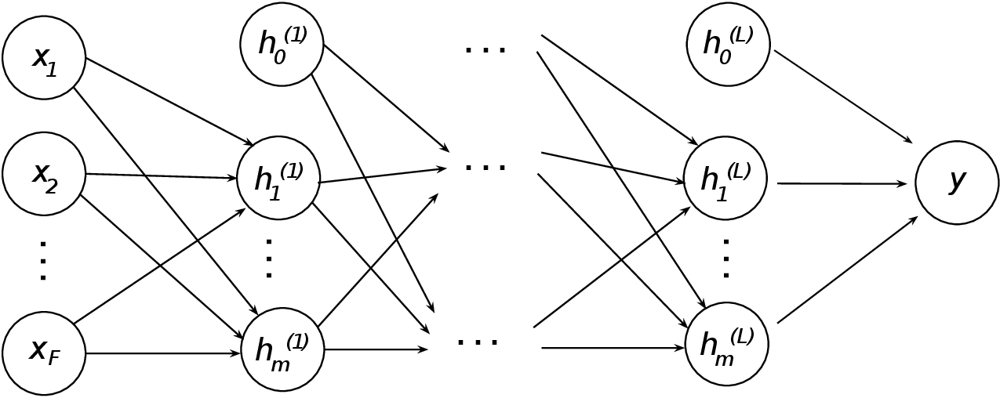</p>

**Figure 2.2:** Typical ANN architecture, with $`(L + 1)`$ layers, $`F`$ units in the input layer, and one unit in the output layer.

The way the neurons are connected defines the architecture of an ANN. Figure 2.2 shows the typical architecture of an ANN, a *Multi-Layer Feedforward Network*. In this architecture, the neurons are organized in consecutive layers, and the connections between the units are weighted by real values called *weights*. The layer that receives the data is called the *input layer*, represented by a vector $`\boldsymbol{x} \in \mathbb{R}^F`$, our (*feature space*). The last layer is called the *output layer* and represents the end result of the network processing.

In the figure 2.2, we use the particular case when the output of the last layer consists of one artificial neuron. That is the adequate architecture for single-variable regression problems, as is our case. Between the input and output layers, there may be a sequence of $`L`$ layers, known as *hidden layers*.

Consider that any neuron – or node – receives a vector $`\boldsymbol{x}=[x_1, x_2, ..., x_N]`$ as input, and computes the following function, known as node pre-activation:

``` math
a(\boldsymbol{x}) = b + \sum_{i}{w_ix_i} = \boldsymbol{b} + \boldsymbol{w}^T\boldsymbol{x}, \tag{2.7}
```

where $`a(\boldsymbol{x})`$ is a scalar and $`b`$ is the bias value, a $`\boldsymbol{x}`$-independent variable, represented in Figure 2.2 to units $`h_{0}^{l}`$, $`1 \leq l \leq L`$.

After computing $`a(\boldsymbol{x})`$, the neuron applies an non-linear transformation to the resulting value, using an activation function, $`g(\cdot)`$, as follows:

``` math
y = h(\boldsymbol{x}) = g(a(\boldsymbol{x})) \tag{2.8}
```

It is important to emphasize that different activation functions result in different behaviors of the neuron. The most commonly used functions are log sigmoid (Equation 2.9), hyperbolic sigmoid (Equation 2.10) and the rectifying function (Equation 2.11). These functions are usually used since they are all differentiable, making derivation of the update equation easier and also due to the fact that they are strictly increasing functions. In addition, an important feature of sigmoid functions is that they always keep output between 0 and 1.

``` math
g(z) = \frac{1}{1+e^{-z}} \tag{2.9}
```
``` math
g(z) = \frac{e^{z}-e^{-z}}{e^{z}+e^{-z}} \tag{2.10}
```
``` math
g(z) = max(0,z) \tag{2.11}
```

Both the pre-activation function and the activation functions of a single neuron can be extended to networks that contain $`L`$ hidden layers, with several neurons in each layer. The equation 2.12 shows the pre-activation function considering a hidden layer, where the value of $`k`$ denotes the $`k`$-th intermediate layer, $`\boldsymbol{W}^{k}`$ is the matrix of weights of the connections between the neurons of layer $`k-1`$ and $`k`$, and the use of bold indicates that the Equation 2.12 is being applied to each neuron of this layer. The same is true for the equation 2.13 of the activation function.

``` math
\boldsymbol{a}^{(k)}(\boldsymbol{x}) = \boldsymbol{b}^{(k)} + \boldsymbol{W}^{(k-1)}(\boldsymbol{x}) \tag{2.12}
```

``` math
\boldsymbol{h}^{(k)}(\boldsymbol{x}) = g(\boldsymbol{a}^{(k)}(\boldsymbol{x})) \tag{2.13}
```

More generally, an artificial neural network for regression problems computes a function $`\hat{y} = f(\boldsymbol{x})`$ such that $`f(\boldsymbol{x}): \mathbb{R}^{F} \rightarrow \mathbb{R}`$, as shown in equation 2.14.

``` math
f(\boldsymbol{x}; \boldsymbol{W},\boldsymbol{b}) = \boldsymbol{h}^{L}(\boldsymbol{x}) = \boldsymbol{o}(\boldsymbol{a}^{L}(\boldsymbol{x})) \tag{2.14}
```

#### 2.5.2 Neural Networks Training

To work properly, ANNs will optimize its parameters $`\boldsymbol{W}`$ and $`\boldsymbol{b}`$ – henceforth denoted by $`\theta`$ – during a process called training, in which an algorithm described in Section 2.5.2 will find the parameters that minimize a given cost (or error) function over multiple *training examples*. This is done by selecting multiple pairs $`(\boldsymbol{x}_t, y_t)`$, where $`\boldsymbol{x}_t`$ is the feature vector and $`y_t`$ is the expected output value for that $`\boldsymbol{x}_t`$. We call a single $`(\boldsymbol{x}_t, y_t)`$ pair a *training example*.

During training, every $`\boldsymbol{x}_t`$ in the training set will be fed to the network, resulting in a estimate $`\hat{y}_t = f(\boldsymbol{x}_t; \theta)`$. Then, these outputs will be compared to the expected outputs using a cost function $`C(y_t, \hat{y_t})`$, that will result in a scalar error value. The parameters of the network should be adjusted to reduce the training error, while also enabling the model to generalize to unseen examples.

##### Gradient Descent

Any optimization algorithm can be used to train ANNs. However, the *gradient descent* (GD) algorithm is commonly used to iteratively obtain approximate solutions, due to the large computational cost of optimal algorithms, when optimizing a large set of parameters, as is the case with ANNs (Goodfellow et al. 2016).

The basic concept of gradient descent, is to start with a random set of parameters, and iteratively adjust them using a given training set. This is done by taking the parameters derivatives vector (gradient) w.r.t the cost, $`\nabla C`$, obtained in the training set.

Using $`\nabla C`$, and applying little adjustments to $`\theta`$, using a adjustment (or learning) rate $`\eta`$, we expect – assuming certain properties of the cost function, parameter space and training examples – to minimize the cost over the training set. In fact, as proven by Hornik, we know that arbitrarily large ANNs, with arbitrarily large training sets, are capable of minimizing any convex cost function (Hornik 1991).

The updating procedure for weights of the network is shown in equation 2.15:

``` math
w^{(s+1)} = w^{(s)} - \eta \nabla C \tag{2.15}
```

where $`w`$ is a specific weight, a connection between a pair of nodes, and $`s`$ an arbitrary update step.

Performing parameters updates for the cost over the entire train dataset is too costly to allow training using large datasets. To circunvent this problem, each update is done using a randomly choosen small subset of the dataset. This technique is called Mini-batch Stochastic Gradient Descent (Goodfellow et al. 2016).

##### Backpropagating Errors

To efficiently evaluate $`\nabla C`$ for all network parameters, we use the algorithm proposed by Rumelhart (Rumelhart et al. 1986), called Error Backpropagation. The algorithm consists of alternately propagating the errors back and forth through the network, using the partial error derivative w.r.t parameters $`\theta`$, using the chain rule to obtain each parameter’s impact on the final prediction error.

What follows is a step by step description of the algorithm, shown in its general form, for multiple output nodes:

1.  Feed $`\boldsymbol{x}_t`$ to the network, computing the output for every node at all layers of the network, before (Equation 2.7), and after (Equation 2.8) the activation function.

2.  Compute the error $`\delta_{i}^{(L+1)}`$ for the output units:
    ``` math
    \delta_{i}^{(L+1)} = \frac{\partial C_{n}}{\partial y_{i}^{(L+1)}}f'(z_{i}^{(L+1)}) \tag{2.16}
    ```

3.  Compute $`\delta_{i}^{(l)}`$ for all hidden layers $`l`$ using error backpropagation:
    ``` math
    \delta_{i}^{(l)} = f'(z_{i}^{(l)})\sum_{k=1}^{m^{(i+1)}}{w_{i,k}^{(l+1)}\delta_{k}^{(l+1)}} \tag{2.17}
    ```

4.  Compute the derivatives:
    ``` math
    \frac{\partial C_{n}}{\partial w_{j,i}^{(l)}} = \delta_{j}^{(l)}y_{i}^{(l-1)} \tag{2.18}
    ```

5.  Update the parameters (Equation 2.15).

The algorithm is a chain rule for derivatives application, that iteratively adjust the parameters of the network, locally towards the configuration that minimizes the training error. The algorithm is detailed on Goodfellow et al. (Goodfellow et al. 2016).

### 2.6 Method Proposal

Based on our formulation of cost function in Section 2.4, we use neural networks to directly solve the quantile forecast, without relying on any assumptions about the underlying probability distributions of neither lead times nor demand. This approach is covered in detail in Chapter 3. As the Pinball Loss Function is convex and derivable, we can use it to train our neural network with real examples of demand and lead times, and use its quantile forecast to properly control inventory levels.

### 2.7 Related work

As described in the work by Oroojlooyjadid et al. (Oroojlooyjadid et al. 2018), most solutions to inventory management using prediction techniques fall into one of the following categories, discussed in the next paragraphs:

- Estimate as a Solution;

- Separated Estimation and Optimization;

- Empirical Quantile;

- Multi-feature Quantile Forecasts.

#### 2.7.1 Estimate as a Solution

Estimate as a solution (EAS) approaches for inventory optimization problems use the forecasted value directly as a solution to the minization problem described in Equation 2.6. However, since EAS methods approximate the expected value – *i.e* the mean – of demand, they do not account for the assimetry inherent to forecast errors for inventory control problems, implicitly assuming $`\tau = 0.5`$ (Oroojlooyjadid et al. 2018).

Mean forecast methods include the family of Autoregressive models such as ARMA, ARIMA, SARIMA, ARCH, GARCH that are used extensively in the literature (Box et al. 2015; Shukla and Jharkharia 2011). Support vector models such as SVMs and SVRs are also used in many works, achieving different results (Yu et al. 2013; Wu and Akbarov 2011; Ali and Yaman 2013).

Hybrid approaches for EAS combine K-means clustering and independent component analysis (Lu and Chang 2014), feature selection and SVR (Ali and Yaman 2013), fuzzy clustering and rule-based methods (Cardoso and Gomide 2007). These, among others, present good enough results in their domains, altough when exposed to volatility or auto correlated demands – specially the AR models – are prone to forecast errors (Oroojlooyjadid et al. 2018). We refer the reader to the work by Ko el al., for an overview on the use of soft computing methods – including Expert Systems, Fuzzy Logic, Neural Networks, and Evolutionary Algorithms – for inventory management problems (Ko et al. 2010).

Using neural networks in EAS methods has been proposed in the literature as an alternative to classical forecasting techniques. An important point in favor of neural networks to solve time-series forecasting is the ease of building multi-feature models that take as input any number of features relevant to forecasting. By features, we mean exogenous variables (also known as covariates, attributes, and explanatory variables) that are predictors of the demand and are available to the decision maker before the ordering occurs (Ban and Rudin 2018).

These features can be related to the buyer, seasonality, special events or dates, own or competitors pricing, own or competitors promotions and any other available information that may be correlated with demand can be used as input. For an extensive review and comparison of various multi-feature and single-feature models for inventory control, we refer the reader to the works by Bala (Bala 2012), Huang et al. (Huang et al. 2014), Ali et al. (Ali et al. 2009) and Ma et al. (Ma et al. 2016).

Efendigil et al. propose the combination of neural networks and fuzzy methods for multi-feature EAS optimization (Efendigil et al. 2009). Later, for the same problem, an ensemble of Deep ANNs was also proposed, using Support Vector Regression as a consensus algorithm between ANNs in the work by Qiu et al., and outperformed non-ensemble methods (Qiu et al. 2014). For a broader survey on the uses of ANNs in time-series forecasting, we refer the reader to the meta-paper by Kourentzes and Crone, where they analyse hundreds of published results (Kourentzes and Crone 2010).

#### 2.7.2 Separated Estimation and Optimization

A second group of forecasting methods for inventory optimization include the techniques based on estimating parameters of – known – probability distributions for demand, and using these parameters to build quantile forecasts. These methods are called, according to the taxonomy presented by Oroojlooyjadid et al. (Oroojlooyjadid et al. 2018), Separated Estimation and Optimization (SEO).

Originally named by Ban and Rudin (Ban and Rudin 2018), SEO methods solve inventory control problems by first estimating the demand distribution and then using the estimate in a control model to solve the minization problem. This idea is widely adopted in practice and in the literature; a broad list of research studies on this approach is given by Turken et al. (Turken et al. 2012).

For example, in addition to estimating the mean of the distribution – $`\mu_Y`$ – as in the EAS approach, one also estimates the standard deviation of the distribution – $`\sigma_Y`$. Then, these parameters can be plugged in a optimization process. The main disadvantage of this approach is that it requires us to assume a particular form of the demand distribution (e.g., normal), whereas empirical demand distributions are often unknown or do not follow a regular form.

A secondary issue with this approach is the combination of the data-estimation and the model-optimality error (Oroojlooyjadid et al. 2018). Rudin and Ban (Ban and Rudin 2018) show that for some realistic settings, the SEO approach is probably suboptimal. The optimization strategy shown in Equation 2.5 is an example of SEO.

#### 2.7.3 Empirical Quantiles

As assuming a particular form of the demand distribution is suboptimal, an alternative is to produce a quantile forecast based on previous observations of demand. This approach was proposed by Bertsimas and Thiele (Bertsimas and Thiele 2005). It consists of sorting the demand observations in ascending order $`y_1 \leq y_2 \leq ... \leq y_n`$ and then estimating the $`\tau`$th quantile of the demand distribution, $`F^{-1}(\tau)`$. This is achieved by observing that the quantile falls 100$`\tau`$% of the way through the sorted list. Thus, using this method, we select the demand $`y_j`$ such that $`j = \lfloor n\tau \rfloor`$, where $`\tau`$ is the desired service level, and $`n`$ is the number of observations available.

This method does not assume any particular form of the demand distribution and does not approximate the probability distribution, so it avoids those pitfalls. However, the model also does not consider exogenous variables. These exogenous variables (or features), can be strongly correlated with demand. One workaround for this problem is to first cluster demand observations according to the categorical features (Ali and Yaman 2013; Ban and Rudin 2018). Unfortunatelly, this clustering approach does not directly support continuous variables, such as price. Another problem is that any information in a cluster is segregated to that cluster and can not be used for inference on another cluster.

#### 2.7.4 Multi-feature Quantile Forecasts

There are numerous models that can be used to make use of features in a quantile forecast. In particular, Taylor (Taylor 2000) introduces the use of neural networks to produce quantile forecasts for multi-period financial returns. The author used a loss function derived from the work by Koenker and Basset (Koenker and Bassett Jr 1978). Since then, several papers that use neural networks for quantile forecasts have been published.

For example, Cannon (Cannon 2011) uses a quantile-regression neural network to predict daily precipitation; El-Telbany (El-Telbany 2014) uses it to predict drug activities; and Xu et al. (Xu et al. 2016) uses a quantile autoregression neural network to evaluate value-at-risk. Further, Bertsimas and Kallus present a general framework for Multi-feature Quantile Forecasts for machine learning methods (Bertsimas and Kallus 2014).

### 2.8 Closing Remarks

This chapter described the theoretical foundation upon which our work is built. After presenting our problem and outlining its caveats, we advanced by connecting the concepts of Service Levels, Quantile Forecasts and the Pinball Loss function, as a way to – respectively – specify requirements for inventory management policies and its associated forecasts; produce robust forecasts under uncertainty; and measure these forecasts performance.

As observed, quantile forecasts are a relevant topic for operations research, specifically on inventory optimization problems, where uncertainty is an inherent component of management policies. Most techniques resort to assumptions about the probability distributions of demand and lead times, and these assumptions can have significant impact on the performance of such policies.

We also asserted the importance of using multi-feature prediction techniques, as exogenous variables can convey information correlated to the demand behavior. We have shown the workings of neural networks, and its fitness for multi-feature quantile forecasts have been justified.

Our proposed method falls into the Multi-feature Quantile Forecasts category of inventory management using prediction techniques. We build upon the work of Bertsimas and Kallus (Bertsimas and Kallus 2014) and generalize the work by Oroojlooyjadid et al. (Oroojlooyjadid et al. 2018) to applications in fixed-time replenishment intervals, complementing theirs newsvendor problem application.

In their work, Bertsimas and Kallus develop a general framework for Operations Research and Management Science decisions using Multi-feature forecasts, without assumptions about the underlying probability distribution of the quantity of interest. The authors extend Machine Learning methods such as K-nearest neighbors, Regression Trees and Local Regression, to support probabilistic forecasts (Bertsimas and Kallus 2014).

Bertsimas and Kallus extend these machine learning techniques for a class of uncertain costs $`c(p, Y)`$, where $`p`$ is a particular management decision, and $`Y`$ is a random variable of interest. However, the authors do not present any results regarding Neural Networks methods. They also do not discuss any implications of $`Y`$ being a convolution of two or more probability distributions (Bertsimas and Kallus 2014).

In the work by Oroojlooyjadid et al., the authors propose the application of Neural Networks methods to inventory managament problems. Although they also do not rely on specific probability distributions, the work is focused on the newsvendor problem – where the replenishment interval and lead times are constant $`\ell_t = r = 1`$ – and as such, do not discuss uncertainties in lead times and its compounding relationship with demand (Oroojlooyjadid et al. 2018).

## 3 Neural Networks for quantile forecasts

In this chapter, we describe the methodology used in building and evaluating our neural network model for quantile forecasts. We begin by detailing our process of dataset construction and the features extracted from the available data. We explain our target generating procedure for training Neural Networks for Quantile Forecasts. At the end, we talk about the training techniques used.

### 3.1 Case study

To train our neural network, we use data for a real retail supermarket operating in Brazil. Table 3.1 describes the annual revenues of seven stores of this retailer, across 4 cities, from January 1, 2018, to December 31, 2018, sorted by revenue in decreasing order.

**Table 3.1:** Retailers stores annual revenue from January 1, 2018, to December 31, 2018, sorted by revenue in decreasing order.

| Store | City   | Annual Revenue   |
|:------|:-------|:-----------------|
| 1     | City 1 | $`\sim`$R\$ 62m  |
| 2     | City 2 | $`\sim`$R\$ 48m  |
| 6     | City 2 | $`\sim`$R\$ 47m  |
| 4     | City 3 | $`\sim`$R\$ 40m  |
| 7     | City 4 | $`\sim`$R\$ 37m  |
| 3     | City 2 | $`\sim`$R\$ 23m  |
| 5     | City 3 | $`\sim`$R\$ 10m  |
| ALL   | ALL    | $`\sim`$R\$ 267m |

As we can see, this retailer has stores with significantly different revenues scales. Further, we show how inventory policy efficacy differs when applied to each of these realities. To Brazilian standards, this retailer is considered medium-sized, as it falls into the R\$ 250m - R\$ 1bn annual revenue range.

Across all stores, we observe that the held inventory takes from 3 to 6 % of annual revenue, when considering the average and the maximum held inventory, respectively. We took the monetary average and maximum of held item stocks in a three-months period, to account for the replenishment intervals, as to get an accurate picture of the held stock. We also exclude from this calculation all items for which the retailer does not hold inventory.

Note that this cost – over R\$16m when considering the maximum held inventory for the period – represents only the net average cost of inventory during the interval under analysis. If operational costs such as staff costs and logistics costs are taken into consideration, this number becomes even more expressive, in the context of low-margin retail supermarket businesses, particularly in a country with high opportunity costs due to elevated interest rates.

As explained in Chapter 1, in this work, we are interested in the best selling items. The top 500 best selling items account for 51% of the company sales revenue (R\$ 139m) in the year under consideration. Figure 3.1 demonstrates the Pareto trade-off behavior on these first 500 items. This behaviour continues for the remaining items of the rank.

<p align="center">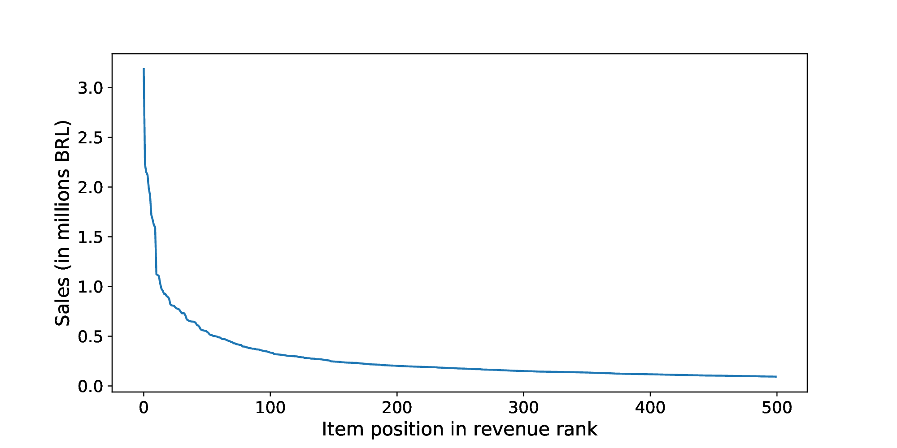</p>

**Figure 3.1:** Items ranked by revenue in 2018

For each tuple \[Store, Date, Item SKU (Stock Keeping Unit)\], we have three features that represent sales for the day: Unit Price; Promotion and Quantity. Here, Promotion is a binary feature that indicates if that item was included in any promotion that day. This collection of sell-out records is henceforth called Daily Sales. Figure 3.2 shows the daily sale records of a particular item in Store 1.

<p align="center">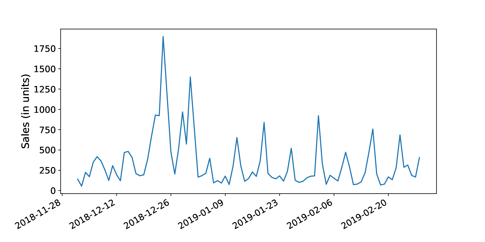</p>

**Figure 3.2:** Sales for a popular brand of beer in Store 1, from December 1, 2018 to March 31, 2019

We also have access to all history of orders placed within and outside the retailer network (purchase orders and distribution orders). We call these records the Orders collection. For each order, the following attributes are available: Date; Supplier; Recipient; Delivery Date; Item SKU (Stock Keeping Unit); Item price and Item quantity.

We have approximately 6 years of records for each collection. We use these two collections to build a dataset to train a Neural Network to perform quantile forecasts for the convolution of demand and lead times probability distributions. These quantile forecasts will then be used to perform inventory management in a simple order up-to policy – as shown in Equation 1.5 – under simulation, as detailed in Section 4.1.

### 3.2 Preprocessing

In this Section, we explain our approach to build the dataset to train and evaluate quantile forecast models. The dataset is composed of a set of instances, each one corresponding to a moment in time in the retailer’s history. Each example is represented by features related to the past sales of an item, as well as to exogenous variables that may be correlated with future sales, as detailed in Section 2.7.1. From the two collections presented in Section 3.1, we build instances that combine all information available to the decision maker at the decision point.

#### 3.2.1 Lagged Series

Since feed forward neural networks are simple logistic regressors stacked in layers, with no memory mechanism, we capture time patterns in the series by feeding past Daily Sales to the network at training and inference time.

<p align="center">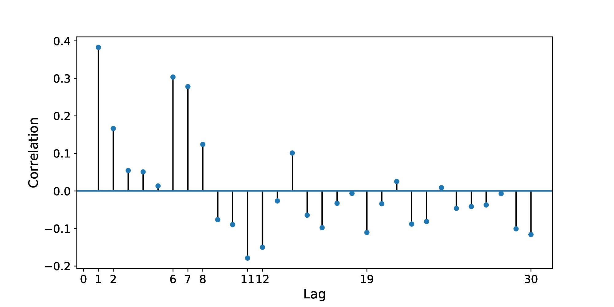</p>

**Figure 3.3:** Autocorrelation plot, with the ten largest absolute autocorrelation values labeled in the X axis.

To accomplish this, we first establish how much of the past will be fed to the neural network, e.g the size of the lagged series (Brockwell et al. 2002), which we call $`\Delta`$. Looking at the autocorrelation plot presented in Figure 3.3, we note that with $`\Delta = 21`$, we capture most of the autocorrelation patterns in the replenishment interval $`r`$ that, as detailed in Section 2.1, is not usually above 15 days for the best selling items.

<p align="center">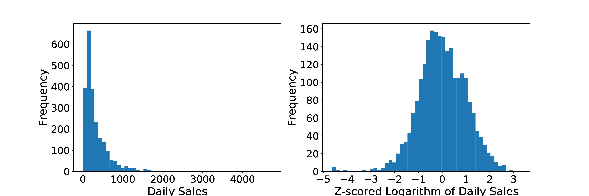</p>

**Figure 3.4:** Histogram of Daily Sales, and the z-scored logarithmic of Daily Sales, respectively.

Before these values are fed to the network, we produce a z-score on the logarithm of the observed values. The z-score is obtained by centralizing and scaling the observation to fit a distribution with a zero mean and one for standard deviation. This is done by subtracting the mean of the observations and dividing the resulting value by the distribution standard deviation (Kelly 1994). In Figure 3.4 we can see the result of this transformation on the distribution.

Under the Shapiro-Wilk test (Kelly 1994), we could not reject the normality hypothesis on this transformed distribution, with a p-value of $`0.05`$. This normalization is frequently used in Machine Learning to compensate for outliers and diminish the effects of inserting features from different probability distributions on the same model (Bishop 2006).

#### 3.2.2 Input features

Besides the lagged series, we also incorporate other features available to the decision maker at the time of placing an order. For the rationale of using multi-feature models please refer to Section 2.7.3.

We start with three variables related to pricing, i.e, the z-score of the price itself at the decision point, and two ternary variables, representing the future and past price trend, respectively. These two ternary variables have a value of $`-1`$ for decreasing prices, $`0`$ for stable prices and $`1`$ for increasing prices.

We also inject seasonality variables into our training and evaluation examples. Specifically, we use categorical variables encoded as one-hot vectors. One-hot vectors (or dummy variables) are used to input categorical information in regression techniques (Goodfellow et al. 2016).

Suppose we have a feature with $`n`$ possible values. We attribute an index to each possible value of the feature. Then, we construct a vector $`\boldsymbol{h}`$, with $`|\boldsymbol{h}| = n`$ and values

``` math
\boldsymbol{h}_i = 
    \begin{cases}
        1 & \text{if the feature value index is equal to $i$} \\
        0 & \text{otherwise}.
    \end{cases} \tag{3.1}
```

The one-hot vectors used will indicate the month and week of the year at the decision point described by a particular instance. This allows the model to correlate a specific time of the year with increases or decreases in sales.

Lastly, we also include a feature to indicate item promotion for the next $`r + \ell`$ days, the expected interval that the order will fulfill the demand for. Our model will then be capable of correlating future promotions of that item with increases or decreases in demand.

With the lagged series and input features, a typical training example for our model is composed of

``` math
X = [d_{t-\Delta-1}, d_{t-\Delta}, d_{t-\Delta+1}, ..., d_{t-1}, \rho_f, \rho_t, \rho_p, s, \boldsymbol{h}^w, \boldsymbol{h}^m], \tag{3.2}
```

where $`t`$ is the decision point in time, $`\rho_t`$, $`\rho_f`$, $`\rho_p`$ and $`s`$ represent – respectively – the current price, the future price trend, past price trend and the promotion indicator. The values $`d_{t-\Delta-1}, d_{t-\Delta}, d_{t-\Delta+1}, ..., d_{t-1}`$ are the z-scored logarithmic values of the past $`\Delta`$ days. We include the one-hot vectors for week of year and month of year as $`\boldsymbol{h}^w`$ and $`\boldsymbol{h}^m`$.

#### 3.2.3 Target

We now specify the target variable $`y_t`$, associated with the $`t`$-th training example. As explained earlier in Equation 1.4, our model will need to produce the quantile forecast for aggregated sales from $`t + \ell_t`$ to $`t + r + \ell_{t + r}`$. As both $`\ell_t`$, and $`\ell_{t + r}`$ are stochastic variables and therefore unknown at the decision point, for our training examples, we sample both $`\ell_t`$ and $`\ell_{t + r}`$ from the past values of lead times present in our Orders collection.

The procedure for generating targets is described in the following algorithm:

**Algorithm 1:** Generating targets for quantile forecasts

1.  $`\ell_t \gets \sim L`$ — *Uniformly sampling from observed lead times*

2.  $`\ell_{t + r} \gets \sim L`$

3.  $`y_t \gets \boldsymbol{d}[t + \ell_t : t + r + \ell_{t + r}]`$ — *The cumulative demand until the next order arrival*

Using this procedure, we can generate examples that closely approximate the expected demand to be fulfilled by an order placed at $`t`$. This sampling procedure also does not make any assumptions about neither the underlying probability distribution of demand nor the probability distribution of lead times, since we uniformly sample over the set of lead times, and use the real demand time series.

To exemplify our target generating procedure, suppose we have a series of observed sales $`\boldsymbol{d} =`$ \[13, 13, 13, 12, 11, 12, 13, 14, 12, 14, 14, 12, 14, 12, 14, 14, 11\] from $`t=0`$ to $`t=16`$. Assume the series of observed lead times to be $`L =`$ \[1, 2, 2\], and our replenishment interval as $`r =`$ 7. Then, for an order placed at $`t=3`$, we could sample $`\ell_t =`$ 2 and $`\ell_{t + r} =`$ 1. That means that the order placed at $`t=3`$ will arrive at $`t=5`$ ($`t + \ell_t`$) and our next possible order is at $`t=12`$ ($`t + r`$). Hence, the order placed at $`t=12`$ arrives at $`t=13`$ ($`t + r + \ell_{t + r}`$). As such, the target for this prediction will be $`y_t =`$ 105, since we aggregate sales from $`t=5`$ to $`t=13`$, \[13, 14, 12, 14, 14, 12, 14, 12\].

With this target, we can train a neural network using the loss function described in Equation 2.6, minimizing the quantile forecast error for the convolution of demand ($`D`$) and lead times ($`L`$) distributions.

### 3.3 Neural Network Architecture and Training

<p align="center">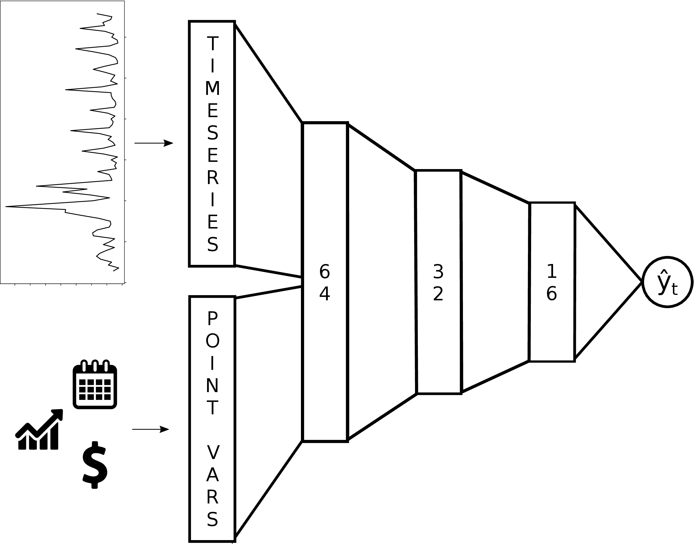</p>

**Figure 3.5:** Neural network architecture used for preliminary experiments

In Figure 3.5, we present the neural network architecture used for our preliminary results shown in Section 4.2. The model was trained with a dataset based on Daily Sales and Orders collections from January 1st, 2013 to January 15th, 2018 (cf. section 3.2).

During training, a technique called dropout was used, that consists on randomly disconnecting nodes from the network between batches of examples, which prevents overfitting (Goodfellow et al. 2016). A dropout rate of 30% was used between each pair of layers. The model was trained during 100 epochs.

The input layer of our network was separated into two blocks, the time series block, and the decision point variables block. The time series block receives as input the preprocessed lagged daily sales. The decision point variables block receives as input all variables that exist only at the decision point. This separation allow us to decouple the time series processing part of the network, as we pretend to experiment with various temporal connectionist methods (cf. section 5.2).

## 4 Simulator, Model evaluation and Preliminary Results

In this chapter, we discuss our implementation of the simulator required to evaluate our quantile forecast models and inventory management policies. We then describe our evaluation process. By the end, we show some preliminary results from our experiments.

### 4.1 Simulating retailer mechanics

To evaluate our models under the most realistic and flexible possible conditions, we implemented a simulator of the relevant retailer mechanics for inventory management, using real world demand and lead times data. We now describe this simulator.

As the relevant retailer processes subject of our work have daily temporal granularity, a discrete-event simulator was used to represent them. Each simulation “tick” represents the passage of one day. Our discrete event simulator was developed using the Simpy language and as such, follows a Process-Oriented paradigm, and implements a Container to represent an item’s inventory. For a complete reference on the Process-Oriented paradigm and Simpy related concepts, we refer to the work by Matloff (Matloff 2008).

Each simulation is scoped in one time interval and replicates the sales behavior of one item in a particular store over that interval. Our simulator works by “replaying” past demand over the selected period and decrementing the inventory container each day by the observed sales of that item. Following this procedure, we use real demand information to evaluate our model.

In Simpy, a Process represents some self-contained system behavior. In our simulator we implement the following retailer mechanics as independent Processes:

- **Daily Sale:** This process runs daily and consumes the item inventory by the amount sold that day. If the inventory is – or reaches – zero, a stock-out is recorded;

- **Inventory Management Policy:** This process is executed from $`r`$ to $`r`$ ticks. It can observe the current inventory level and any information available on that tick – such as a quantile forecast – to make purchase decisions and start an Order Process for a specific quantity.

- **Order:** This process is started from the Inventory Policy Process and is parameterized by the ordered quantity. It samples with replacement a lead time ($`\ell_t`$) uniformly from the past observed lead times set for that particular item, from our Orders collection ($`L`$). After $`\ell_t`$ ticks have passed, it places the ordered quantity into the inventory Container. Hence, we do not need to make assumptions about the underlying distributions of lead times.

In Figure 4.1, we can see our simulator working. In this particular example, we used the Optimal Policy for inventory management. The Optimal Policy is a particular implementation of the Inventory Management Policy Process that knows in advance the future values of demand and lead times. In this way, it always orders the correct quantities, never incurs in stock-outs and has a Pinball Loss of zero. The pattern in the plot represents the time series optimal inventory level. We use the Optimal Policy throughout this work as a baseline for evaluating presented models, as it represents the lower bound on inventory levels that meet the demand – our goal for the best selling items.

<p align="center">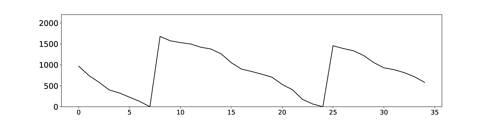</p>

**Figure 4.1:** Optimal policy applied under simulation with real demand and lead times.

### 4.2 Model evaluation and Preliminary Results

We use the proposed simulator to to evaluate our model and baselines. As evaluation metric, we use the aggregate Pinball Loss (cf. Equation 1.8) for all purchase decision policies. After the simulation period is defined, we take all available information in our collections from that point backward and use it to fit our models.

All evaluations are done using the same parameters, such as replenishment intervals and collections of lead times (and its sampling). The same daily sales are shown to the models during simulation. They are also trained using the same feature set. This guarantees that the only distinction between results is due to more robust forecasting, that directly reflects in purchase decisions, and consequently on the Pinball Loss for each model/policy.

Figure 4.2 compares our model (blue line) and the baseline described in Section 2.3 (red line). This technique, which we refer as SEO, assumes that lead times and demand follow Gaussian stationary distributions. The figure also shows the optimal inventory series in dotted black.

We fill the area between the curves in red when our method is outperformed. Conversely, a green color filling indicates our method performed better than the baseline. In this preliminary test, the baseline outperformed our method, achieving a Pinball Loss of 615.25, while our neural network obtained a 863.24 loss value. The neural network incurred in one stock out day, against two of our baseline.

<p align="center">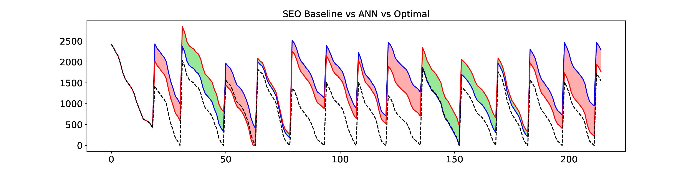</p>

**Figure 4.2:** Comparison between neural network inventory series (blue line), optimal inventory series (dashed line) and baseline inventory series (red line) for a popular brand of beer. Stock outs were observed for the baseline model at around the 60th tick, and around the 150th tick for our neural network.

The first results obtained when applying the described techniques to our dataset have shown to be comparable to our baseline methods, even when using a simple, shallow feed-forward network with no hyperparameters tunning. We expect to surpass our baselines by a statiscally significant margin when applying more sophisticated neural network models and training techniques.

## 5 Open Problems and Next Steps

In this chapter we discuss the open problems to be addressed in the next developments of this thesis. We also propose a schedule for tackling such questions and discuss next steps.

### 5.1 Aggregated Pinball Loss

By construction, the loss function used to train and evaluate our models described in Equation 1.8 has its values related to quantities sold. This poses a problem when marginalizing forecast errors. Items or stores that have significant difference in sales scale, can not have their losses directly aggregated as their impact will not be weighted to compensate for these differences. We propose to develop an unitless metric to allow for direct comparison between products and stores.

### 5.2 Temporal Connectionist Methods

Given the time-series characteristic of our problem, a natural extension to the feed-forward neural networks applied in our preliminary experiments are the neural network models that structurally comport time-series. We propose to experiment with the following models:

- Recurrent Neural Networks (Rumelhart et al. 1986);

- Long Short-Term Memory Networks (Hochreiter and Schmidhuber 1997);

- Gated Recurrent Units Networks (Cho et al. 2014);

- Dilated Causal Convolutions (Oord et al. 2016);

- Stochastic Temporal Convolutional Networks (Aksan and Hilliges 2019).

### 5.3 B and C segments

To better assess the robustness of our method and the related fragility of the probability distribution assumptions of our baselines, we propose to experiment with slower movement items, as the products encountered in the B and C segments of the ABC curve discussed in Chapter 1. As shown (cf. section 2.2), the gaussian assumptions are prone to produce errors in quantile forecasts when items with fewer units sold are taken into consideration.

### 5.4 Schedule

To solve the aforementioned questions, this scheduled is proposed for the following months:

<p align="center">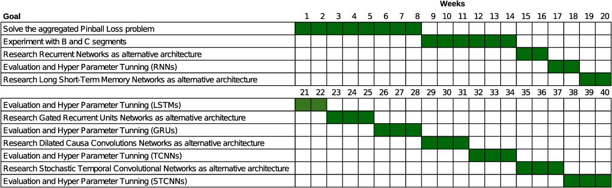</p>

**Figure 5.1:** Proposed schedule.

## References

Aastrup, Jesper, and Herbert Kotzab. 2010. “Forty Years of Out-of-Stock Research–and Shelves Are Still Empty.” *The International Review of Retail, Distribution and Consumer Research* 20 (1): 147–64.

Agrawal, Narendra, and Stephen A Smith. 1996. “Estimating Negative Binomial Demand for Retail Inventory Management with Unobservable Lost Sales.” *Naval Research Logistics (NRL)* 43 (6): 839–61.

Agrawal, Narendra, and Stephen A Smith. 2013. “Optimal Inventory Management for a Retail Chain with Diverse Store Demands.” *European Journal of Operational Research* 225 (3): 393–403.

Aksan, Emre, and Otmar Hilliges. 2019. “STCN: Stochastic Temporal Convolutional Networks.” *arXiv Preprint arXiv:1902.06568*.

Ali, Özden Gür, Serpil Sayın, Tom Van Woensel, and Jan Fransoo. 2009. “SKU Demand Forecasting in the Presence of Promotions.” *Expert Systems with Applications* 36 (10): 12340–48.

Ali, Özden Gür, and Kübra Yaman. 2013. “Selecting Rows and Columns for Training Support Vector Regression Models with Large Retail Datasets.” *European Journal of Operational Research* 226 (3): 471–80.

Bagchi, Uttarayan, Jack C. Hayya, and Chao Hsien Chu. 1986. “The Effect of Lead-Time Variability: The Case of Independent Demand.” *Journal of Operations Management* 6 (2): 159–77. <https://doi.org/10.1016/0272-6963(86)90023-9>.

Bala, Pradip Kumar. 2012. “Improving Inventory Performance with Clustering Based Demand Forecasts.” *Journal of Modelling in Management* 7 (1): 23–37.

Ban, Gah-Yi, and Cynthia Rudin. 2018. “The Big Data Newsvendor: Practical Insights from Machine Learning.” *Operations Research* 67 (1): 90–108.

Banks, Jerry, and JP Spoerer. 1986. “Inventory Policy for the Continuous Review Case: A Simulation Approach.” *Annals of the Society of Logistics Engineers* 1 (1).

Bartezzaghi, Emilio, Roberto Verganti, and Giulio Zotteri. 1999. “Measuring the Impact of Asymmetric Demand Distributions on Inventories.” *International Journal of Production Economics* 60: 395–404.

Bertsimas, Dimitris, and Nathan Kallus. 2014. “From Predictive to Prescriptive Analytics.” *arXiv Preprint arXiv:1402.5481*.

Bertsimas, Dimitris, and Aurélie Thiele. 2005. “A Data-Driven Approach to Newsvendor Problems.” *Working Paper, Massachusetts Institute of Technology*.

Biau, Gérard, and Benoı̂t Patra. 2011. “Sequential Quantile Prediction of Time Series.” *IEEE Transactions on Information Theory* 57 (3): 1664–74.

Bishop, Christopher M. 2006. *Pattern Recognition and Machine Learning*. Springer.

Box, George EP, Gwilym M Jenkins, Gregory C Reinsel, and Greta M Ljung. 2015. *Time Series Analysis: Forecasting and Control*. John Wiley & Sons.

Bradford, John W, and Paul K Sugrue. 1990. “A Bayesian Approach to the Two-Period Style-Goods Inventory Problem with Single Replenishment and Heterogeneous Poisson Demands.” *Journal of the Operational Research Society* 41 (3): 211–18.

Brockwell, Peter J, Richard A Davis, and Matthew V Calder. 2002. *Introduction to Time Series and Forecasting*. Vol. 2. Springer.

Burgin, TA. 1975. “The Gamma Distribution and Inventory Control.” *Journal of the Operational Research Society* 26 (3): 507–25.

Cannon, Alex J. 2011. “Quantile Regression Neural Networks: Implementation in r and Application to Precipitation Downscaling.” *Computers & Geosciences* 37 (9): 1277–84.

Cardoso, G, and F Gomide. 2007. “Newspaper Demand Prediction and Replacement Model Based on Fuzzy Clustering and Rules.” *Information Sciences* 177 (21): 4799–809.

Chen, Frank, Zvi Drezner, Jennifer K Ryan, and David Simchi-Levi. 2000. “Quantifying the Bullwhip Effect in a Simple Supply Chain: The Impact of Forecasting, Lead Times, and Information.” *Management Science* 46 (3): 436–43.

Cho, Kyunghyun, Bart Van Merriënboer, Caglar Gulcehre, et al. 2014. “Learning Phrase Representations Using RNN Encoder-Decoder for Statistical Machine Translation.” *arXiv Preprint arXiv:1406.1078*.

Efendigil, Tuğba, Semih Önüt, and Cengiz Kahraman. 2009. “A Decision Support System for Demand Forecasting with Artificial Neural Networks and Neuro-Fuzzy Models: A Comparative Analysis.” *Expert Systems with Applications* 36 (3): 6697–707.

El-Telbany, Mohammed E. 2014. “What Quantile Regression Neural Networks Tell Us about Prediction of Drug Activities.” *2014 10th International Computer Engineering Conference (ICENCO)*, 76–80.

Eppen, Gary D, and R Kipp Martin. 1988. “Determining Safety Stock in the Presence of Stochastic Lead Time and Demand.” *Management Science* 34 (11): 1380–90.

Fisher, Marshall, Kumar Rajaram, and Ananth Raman. 2001. “Optimizing Inventory Replenishment of Retail Fashion Products.” *Manufacturing & Service Operations Management* 3 (3): 230–41.

Gallego, Guillermo. 1992. “A Minmax Distribution Free Procedure for the (q, r) Inventory Model.” *Operations Research Letters* 11 (1): 55–60.

Gneiting, Tilmann, and Adrian E Raftery. 2007. “Strictly Proper Scoring Rules, Prediction, and Estimation.” *Journal of the American Statistical Association* 102 (477): 359–78.

Goodfellow, Ian, Yoshua Bengio, and Aaron Courville. 2016. *Deep Learning*. MIT press.

Graves, Stephen C. 1996. “A Multiechelon Inventory Model with Fixed Replenishment Intervals.” *Management Science* 42 (1): 1–18.

Greenwald, Bruce C, and Judd Kahn. 2005. *Competition Demystified: A Radically Simplified Approach to Business Strategy*. Penguin.

Hax., Arnoldo C., and Dan. Candea. 1984. *Production and Inventory Management / Arnoldo c. Hax, Dan Candea*. Book. Prentice-Hall Englewood Cliffs, N.J.

Hochreiter, Sepp, and Jürgen Schmidhuber. 1997. “Long Short-Term Memory.” *Neural Computation* 9 (December): 1735–80. <https://doi.org/10.1162/neco.1997.9.8.1735>.

Hornik, Kurt. 1991. “Approximation Capabilities of Multilayer Feedforward Networks.” *Neural Networks* 4 (2): 251–57.

Huang, Tao, Robert Fildes, and Didier Soopramanien. 2014. “The Value of Competitive Information in Forecasting FMCG Retail Product Sales and the Variable Selection Problem.” *European Journal of Operational Research* 237 (2): 738–48.

Hugos, Michael H. 2018. *Essentials of Supply Chain Management*. John Wiley & Sons.

Keaton, Mark. 1995. “Using the Gamma Distribution to Model Demand When Lead Time.” *Journal of Business Logistics* 16 (1): 107.

Kelly, Douglas G. 1994. *Introduction to Probability*. Macmillan New York.

Ko, Mark, Ashutosh Tiwari, and Jörn Mehnen. 2010. “A Review of Soft Computing Applications in Supply Chain Management.” *Applied Soft Computing* 10 (3): 661–74.

Koenker, Roger, and Gilbert Bassett Jr. 1978. “Regression Quantiles.” *Econometrica: Journal of the Econometric Society*, 33–50.

Kourentzes, Nikolaos, and Sven Crone. 2010. *Advances in Forecasting with Artificial Neural Networks*.

Lu, Chi-Jie, and Chi-Chang Chang. 2014. “A Hybrid Sales Forecasting Scheme by Combining Independent Component Analysis with k-Means Clustering and Support Vector Regression.” *The Scientific World Journal* 2014.

Ma, Shaohui, Robert Fildes, and Tao Huang. 2016. “Demand Forecasting with High Dimensional Data: The Case of SKU Retail Sales Forecasting with Intra-and Inter-Category Promotional Information.” *European Journal of Operational Research* 249 (1): 245–57.

Matloff, Norm. 2008. “Introduction to Discrete-Event Simulation and the Simpy Language.” *Davis, CA. Dept of Computer Science. University of California at Davis. Retrieved on August* 2 (2009): 1–33.

Moon, Ilkyeong, and Guillermo Gallego. 1994. “Distribution Free Procedures for Some Inventory Models.” *Journal of the Operational Research Society* 45 (6): 651–58.

Nahmias, Steven. 1994. “Demand Estimation in Lost Sales Inventory Systems.” *Naval Research Logistics (NRL)* 41 (6): 739–57.

Oord, Aaron van den, Sander Dieleman, Heiga Zen, et al. 2016. “Wavenet: A Generative Model for Raw Audio.” *arXiv Preprint arXiv:1609.03499*.

Oroojlooyjadid, Afshin, Lawrence Snyder, and Martin Takáč. 2018. “Applying Deep Learning to the Newsvendor Problem.” *arXiv Preprint arXiv:1607.02177*.

Peterson, R., and E. A. Silver. 1979. *Decision Systems for Inventory Management and Production Planning*. Wiley/Hamilton Series in Management and Administration. Wiley. <https://books.google.com.br/books?id=UBJPAAAAMAAJ>.

Qiu, Xueheng, Le Zhang, Ye Ren, Ponnuthurai N Suganthan, and Gehan Amaratunga. 2014. “Ensemble Deep Learning for Regression and Time Series Forecasting.” *2014 IEEE Symposium on Computational Intelligence in Ensemble Learning (CIEL)*, 1–6.

Ramaekers, Katrien, Gerrit K Janssens, et al. 2008. “On the Choice of a Demand Distribution for Inventory Management Models.” *European Journal of Industrial Engineering* 2 (4): 479–91.

Rumelhart, David E, Geoffrey E Hinton, and Ronald J Williams. 1986. “Learning Representations by Back-Propagating Errors.” *Nature* 323 (6088): 533.

Russell, Roberta S, and Bernard W Taylor. 2005. *Operations Management: Quality and Competitiveness in a Global Environment*. Wiley.

Scarf, Herbert E. 1957. *A Min-Max Solution of an Inventory Problem*. RAND CORP SANTA MONICA CALIF.

Shukla, Manish, and Sanjay Jharkharia. 2011. “ARIMA Models to Forecast Demand in Fresh Supply Chains.” *International Journal of Operational Research* 11 (1): 1–18.

Smith, Stephen A, and Narendra Agrawal. 2000. “Management of Multi-Item Retail Inventory Systems with Demand Substitution.” *Operations Research* 48 (1): 50–64.

Song, Jing-Sheng, Candace A Yano, and Panupol Lerssrisuriya. 2000. “Contract Assembly: Dealing with Combined Supply Lead Time and Demand Quantity Uncertainty.” *Manufacturing & Service Operations Management* 2 (3): 287–96.

Taylor, James W. 2000. “A Quantile Regression Neural Network Approach to Estimating the Conditional Density of Multiperiod Returns.” *Journal of Forecasting* 19 (4): 299–311.

Turken, Nazli, Yinliang Tan, Asoo J Vakharia, Lan Wang, Ruoxuan Wang, and Arda Yenipazarli. 2012. “The Multi-Product Newsvendor Problem: Review, Extensions, and Directions for Future Research.” In *Handbook of Newsvendor Problems*. Springer.

Tyworth, John E, Yuanming Guo, and Ram Ganeshan. 1996. “Inventory Control Under Gamma Demand and Random Lead Time.” *Journal of Business Logistics* 17 (1): 291.

Tyworth, John E, and Liam O’Neill. 1997. “Robustness of the Normal Approximation of Lead-Time Demand in a Distribution Setting.” *Naval Research Logistics (NRL)* 44 (2): 165–86.

Walter, Clyde K, and John R Grabner. 1975. “Stockout Cost Models: Empirical Tests in a Retail Situation.” *The Journal of Marketing*, 56–60.

Wu, Shaomin, and Artur Akbarov. 2011. “Support Vector Regression for Warranty Claim Forecasting.” *European Journal of Operational Research* 213 (1): 196–204.

Xu, Qifa, Xi Liu, Cuixia Jiang, and Keming Yu. 2016. “Quantile Autoregression Neural Network Model with Applications to Evaluating Value at Risk.” *Applied Soft Computing* 49: 1–12.

Yu, Xiaodan, Zhiquan Qi, and Yuanmeng Zhao. 2013. “Support Vector Regression for Newspaper/Magazine Sales Forecasting.” *Procedia Computer Science* 17: 1055–62.

[^1]: ABC classification allows an organization to separate items into three groups: A – very important, B – important, and C – least important. The amount of time, effort, and resources spent on inventory control should be in the relative importance of each item (Hugos 2018). Our measure of importance will be contribution to revenue.
